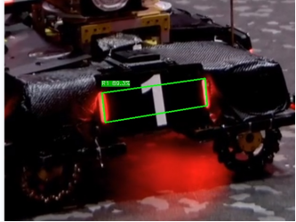

# 基于ROS2与OpenCV4实现装甲板的识别

 

## 问题背景

RMUA是全自动机器人对抗比赛。其中最为重要的一环就是对对方机器人的装甲板进行识别与定位。

装甲板的识别算法，通过处理图像找到相机视野范围内的装甲板（相机一般安装在云台上，和枪口平行放置并指向同一个方向，类似瞄准镜），进而向下位机（STM32等用于控制的MCU, microcontroller unit,单片机）发送此装甲板的相对枪口的角度数据，电控根据此数据控制电机自动转向目标装甲板，实现装甲板的自动打击。

 

 

## **任务介绍**

设计一套识别算法，对提供的视频素材中的装甲板进行识别并框选，同时还要识别装甲板的颜色

 

## 具体要求

- 基于Ubuntu20.04环境，使用ROS2平台与OpenCV4进行开发

- vision task.tar里面的内容是视频素材，解压后使用ROS2 里面的`rosbag play`命令进行播放 

## **提交内容**

- Git完整代码文件夹到GitHub

- 上传视频演示文件到群文件（飞书）

 

## **进阶任务**

识别装甲板数字并标注

 